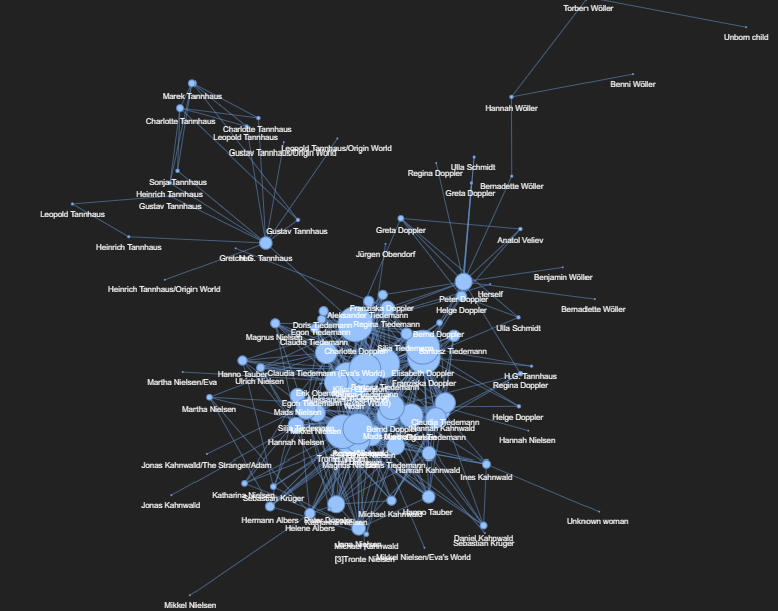

# Dark Series Netflix Character Network Analysis

## Table of Contents

- [Project Overview](#project-overview)
- [Prerequisites](#prerequisites)
- [Data](#data)
- [Data Preprocessing](#data-preprocessing)
- [Model Building](#model-building)
- [Visualization](#visualization)
- [Analysis](#analysis)
- [Contact](#contact)
## Project Overview

This data science project focuses on conducting an end-to-end network analysis of characters from the Netflix series "Dark." The series revolves around time travel, leading to complex relationships among its characters. The primary objectives of this project are:

- Scraping character data from the Dark Netflix Series Fandom Wiki.
- Engineering the extracted data to create a network dataset representing character relationships.
- Visualizing and analyzing the character network using Python.

## Prerequisites

- Python 3.11.4
- Required Python packages:
  - pandas
  - networkx
  - pyvis
  - matplotlib
  - requests
  - BeautifulSoup

## Data
Data
The data for this project is extracted from the Dark Netflix Series Fandom Wiki, specifically from the following URL:
https://dark-netflix.fandom.com/wiki/Category:Characters

The scraped data is organized into a pandas DataFrame with three columns:

Character Name: Name of the character.
Image Link: Link to the character's image.
Relations: Unorganized information about the character's relationships.

## Preprocessing

To prepare the data for network analysis, we perform the following preprocessing steps:

Extract individual relationships between characters.
Create three columns: Source Node, Target Node, and Relation.
Clean and format character names to ensure data consistency.

## Model Building
The core of this project is the creation of a character network using NetworkX. We build a graph where nodes represent characters, and edges represent their relationships. Further analysis can be performed on this network.

## Visualization
We visualize the character network using two methods:

Static visualization using Matplotlib.
Dynamic visualization using Pyvis, allowing for interactive exploration of character relationships.

## Analysis
The analysis can include a focus on the complex parenthood relationships within the character network, which often become intertwined due to the time travel theme in the series.

## Contact
For questions or further information, please contact mahendrayana at [mahendrayana203@gmail.com].